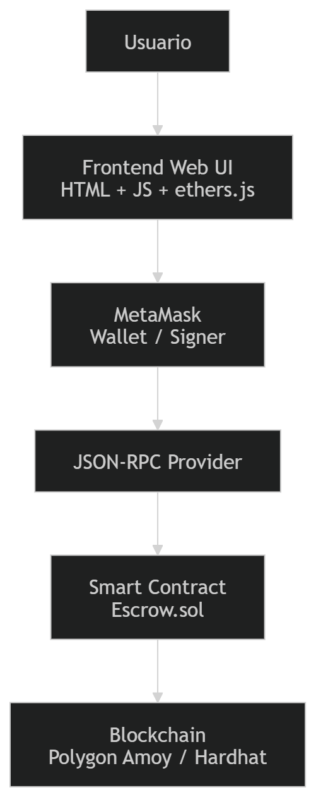
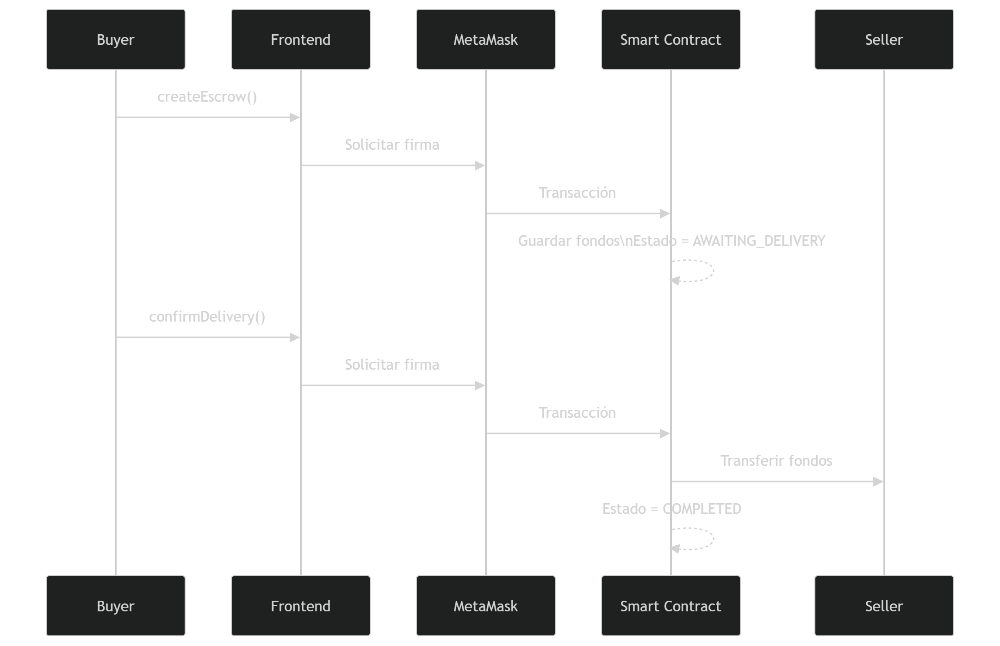
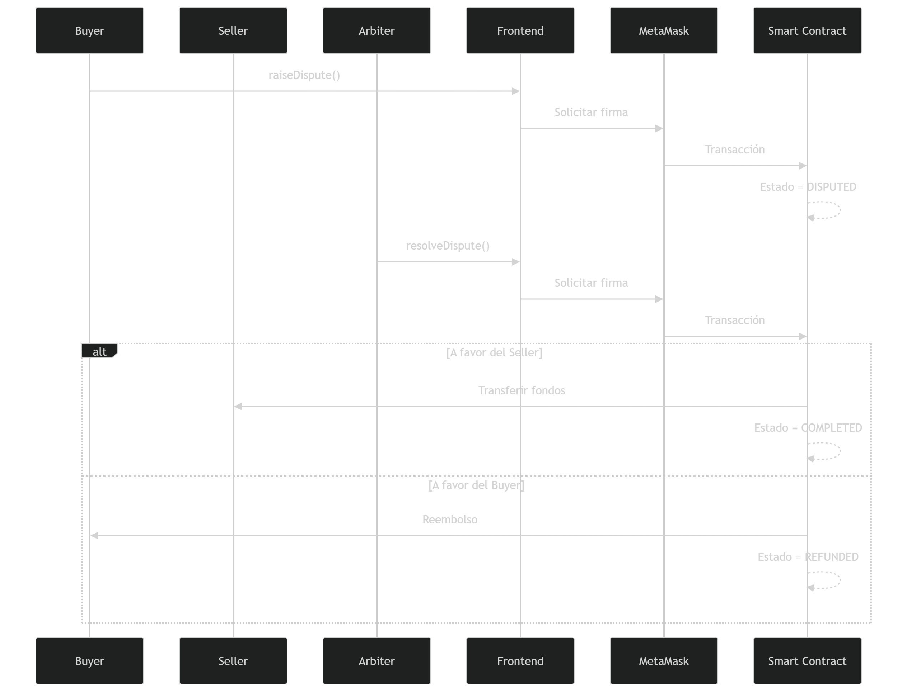
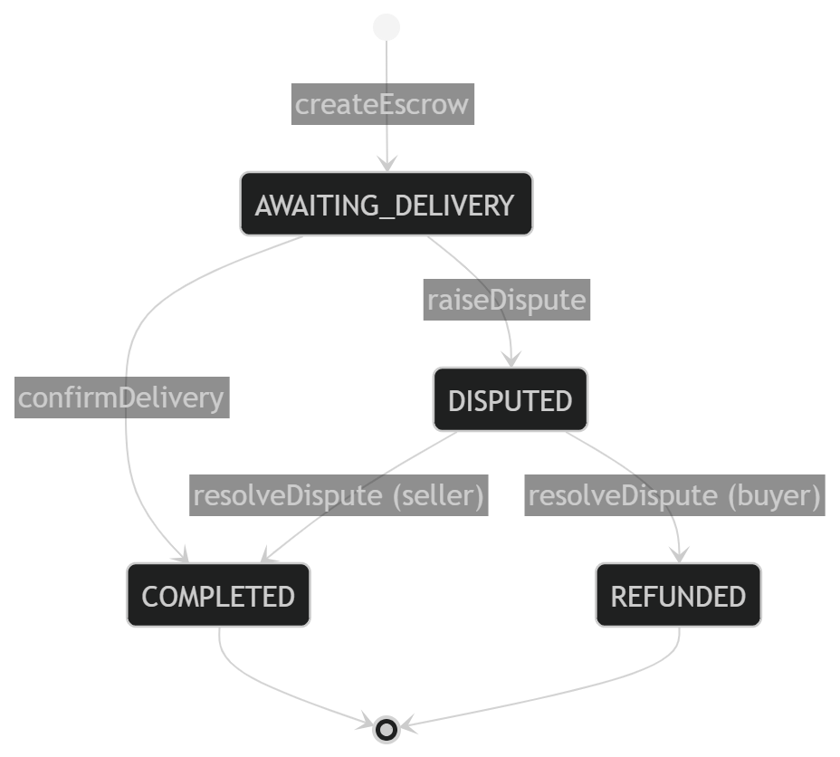
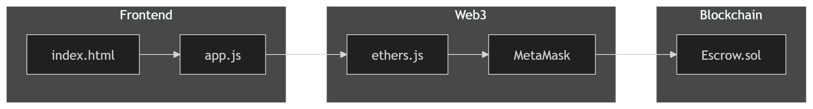

# blockchain-gr40-escrow

Proyecto final del curso **Blockchain y Ledgers Distribuidos GR40**: implementación de un sistema Escrow mediante Smart Contracts.

---

## Descripción del Sistema

Un **Escrow** (custodia) es un mecanismo financiero en el que un tercero neutral retiene fondos durante una transacción entre dos partes (comprador y vendedor), liberándolos únicamente cuando se cumplen las condiciones acordadas.

Este proyecto implementa un sistema de Escrow descentralizado sobre la blockchain de Polygon (Amoy Testnet), eliminando la necesidad de confiar en un intermediario centralizado. El Smart Contract actúa como el custodio imparcial que:

- **Recibe y custodia** los fondos depositados por el comprador.
- **Libera el pago** al vendedor cuando el comprador confirma la recepción del bien o servicio.
- **Permite reembolsos** al comprador si el vendedor no cumple, mediante la intervención de un árbitro.
- **Resuelve disputas** a través de un árbitro designado que puede decidir a favor del comprador o vendedor.

## Justificación del uso de Blockchain

El uso de blockchain en este sistema permite:

- **Descentralización**: elimina la necesidad de un intermediario confiable
- **Inmutabilidad**: evita la manipulación de transacciones
- **Transparencia**: todas las partes pueden auditar el estado del contrato
- **Trustless**: comprador y vendedor no necesitan confiar entre sí

Esto hace que el escrow sea más seguro y resistente a fraudes en comparación con soluciones centralizadas.

### Actores del Sistema

| Actor | Rol |
|-------|-----|
| **Comprador (Buyer)** | Deposita los fondos en el contrato. Confirma la entrega para liberar el pago. |
| **Vendedor (Seller)** | Recibe el pago una vez que el comprador confirma o el árbitro falla a su favor. |
| **Árbitro (Arbiter)** | Interviene solo en caso de disputa. Puede liberar fondos al vendedor o reembolsar al comprador. |

### Funcionalidades Principales

1. **Depositar fondos**: El comprador envía POL/ETH al contrato, iniciando el escrow.
2. **Liberar pago**: El comprador confirma que recibió el bien/servicio y los fondos se transfieren al vendedor.
3. **Abrir disputa**: Comprador o vendedor pueden abrir una disputa si hay desacuerdo.
4. **Resolución por árbitro**: El árbitro decide si liberar al vendedor o reembolsar al comprador.

## Modelo On-chain vs Off-chain

### On-chain (Blockchain)
- Custodia de fondos
- Estados del escrow
- Resolución de disputas
- Transferencias de valor

### Off-chain
- Entrega del bien o servicio
- Interacción del usuario (UI)
- Decisiones humanas (confirmación, disputa)

El sistema combina lógica on-chain segura con procesos off-chain inevitables en el mundo real. Este modelo se refleja en la arquitectura del sistema, donde el Smart Contract y la Blockchain representan la lógica on-chain, mientras que el frontend y la interacción del usuario corresponden a la capa off-chain.

## Consideraciones de Seguridad

- Validación de roles mediante `msg.sender`
- Uso de `require` para garantizar condiciones válidas
- Control de estados para evitar ejecuciones indebidas
- Prevención de reentrancy en transferencias
- Uso de patrón checks-effects-interactions
- Riesgo de árbitro malicioso considerado en el diseño

---

## Arquitectura

El proyecto sigue una arquitectura típica de una DApp (Aplicación Descentralizada), compuesta por múltiples componentes que interactúan entre sí:

- **Frontend (Web UI)**: Interfaz de usuario desarrollada en HTML, CSS y JavaScript.
- **Wallet (MetaMask)**: Gestiona las cuentas del usuario y firma las transacciones.
- **Provider (JSON-RPC)**: Canal de comunicación entre la aplicación y la blockchain.
- **Smart Contract**: Implementa la lógica de negocio del escrow.
- **Blockchain (EVM)**: Ejecuta y almacena el estado del contrato.

Esta arquitectura refleja el modelo real de interacción en aplicaciones Web3, donde la firma de transacciones y la comunicación con la red están desacopladas del frontend.



### Stack Tecnológico

| Componente | Tecnología |
|------------|------------|
| Smart Contract | Solidity ^0.8.20 |
| Entorno de desarrollo | Hardhat |
| Blockchain local | Hardhat Network |
| Testnet | Polygon Amoy |
| Frontend | HTML, CSS, JavaScript |
| Librería Web3 | ethers.js |
| Wallet | MetaMask |
| Testing | Chai + Hardhat Chai Matchers |

### Estructura del Proyecto

```
blockchain-gr40-escrow/
├── contracts/
│   └── Escrow.sol            # Smart Contract del Escrow
├── scripts/
│   ├── deploy.js             # Script de despliegue
│   └── interact.js           # Script de interacción por consola
├── test/
│   └── Escrow.js             # Tests unitarios del contrato
├── web/
│   └── escrow/
│       ├── index.html        # Interfaz de usuario
│       └── app.js            # Lógica de conexión con el contrato
├── .env.example              # Variables de entorno de ejemplo
├── hardhat.config.js         # Configuración de Hardhat y redes
├── package.json              # Dependencias del proyecto
└── README.md                 # Este archivo
```

---

## Flujo de Transacciones

### Flujo Principal (Sin Disputa)

El flujo inicia cuando el comprador crea el escrow y deposita los fondos en el contrato. 
Una vez entregado el bien o servicio (off-chain), el comprador confirma la entrega, 
lo que provoca la liberación automática de los fondos al vendedor.



### Flujo con Disputa

Si existe desacuerdo entre las partes, cualquiera puede abrir una disputa. 
En este estado, el contrato bloquea los fondos hasta que el árbitro interviene 
y decide si liberar el pago al vendedor o reembolsar al comprador.



### Diagrama de Estados

El contrato funciona como una máquina de estados, donde cada transición 
está controlada por funciones específicas y validaciones de acceso, 
garantizando que no se ejecuten acciones inválidas.



### Estados del Escrow

| Estado | Descripción |
|--------|-------------|
| `AWAITING_DELIVERY` | Fondos depositados, esperando que el comprador confirme la entrega. |
| `DISPUTED` | Una de las partes abrió una disputa. Solo el árbitro puede resolver. |
| `COMPLETED` | Fondos liberados al vendedor. Transacción finalizada. |
| `REFUNDED` | Fondos reembolsados al comprador. Transacción cancelada. |

---

## Diagrama de Componentes

El diagrama de componentes muestra la interacción entre los elementos principales de la DApp. 
El frontend gestiona la interfaz de usuario y utiliza ethers.js para comunicarse con el contrato inteligente. 
MetaMask actúa como intermediario para firmar transacciones y conectarse a la red blockchain mediante el provider JSON-RPC. 
El smart contract ejecuta la lógica de negocio on-chain, mientras que Hardhat se utiliza únicamente como entorno de desarrollo para compilación, testing y despliegue.



### Interacción entre Componentes

| Componente | Responsabilidad | Comunica con |
|------------|----------------|--------------|
| **index.html** | Interfaz gráfica para el usuario | app.js |
| **app.js** | Conecta la UI con el contrato vía ethers.js | MetaMask, Escrow.sol |
| **MetaMask** | Firma transacciones y gestiona cuentas | Blockchain (JSON-RPC) |
| **Escrow.sol** | Lógica de negocio on-chain: custodia, liberación, disputas | Blockchain (EVM) |
| **Hardhat** | Compilación, testing y despliegue (entorno de desarrollo) | Escrow.sol, Blockchain |

---

## Cómo Ejecutar

### Prerrequisitos

- Node.js >= 18
- Yarn
- MetaMask (extensión del navegador)

### Instalación

```bash
yarn install
```

### Compilar Contratos

```bash
yarn compile
```

### Ejecutar Tests

```bash
yarn test
```

### Desplegar Localmente

```bash
# Terminal 1: Levantar nodo local
yarn local:node

# Terminal 2: Desplegar contrato
yarn local:deploy
```

### Desplegar en Polygon Amoy

```bash
# Configurar .env con las credenciales
cp .env.example .env
# Editar .env con tu PRIVATE_KEY y AMOY_RPC_URL

yarn amoy:deploy
```
